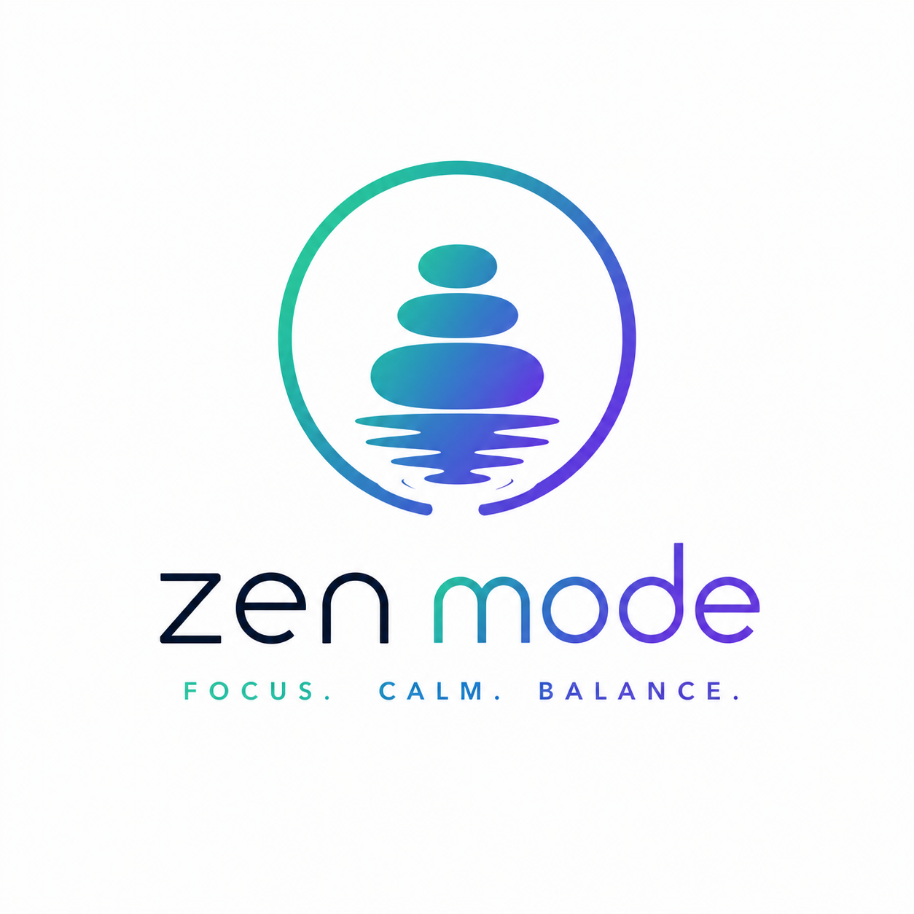
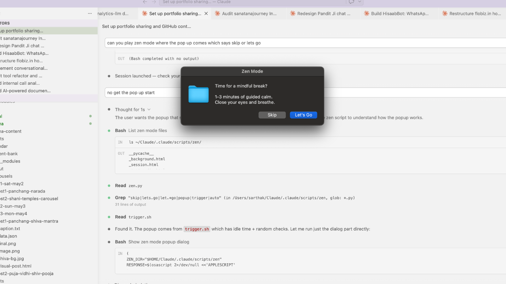

<p align="center">
  
</p>

# Zen Mode

**Auto-triggered meditation for developers. Detects when you're idle, pops up a mindful break with nature videos, cultural wisdom, and guided breathing.**

<p align="center">
  
</p>

<p align="center">
  
</p>

<p align="center">
  
</p>

<p align="center">
  
</p>

## Why

You code for hours without a break. Your back hurts, your eyes are strained, and you don't even notice. Zen Mode watches for idle moments and gently nudges you with a popup: "Time for a mindful break?" Skip or accept -- no pressure. If you accept, a full-screen meditation launches with real nature footage, ambient sound, and a random cultural learning from Buddhist, Stoic, Hindu, and Japanese philosophy.

## How

1. A PostToolUse hook runs `trigger.sh` after every Claude Code tool call
2. If you've been idle for 45+ seconds, a 12% random roll passes, and 25+ minutes since last trigger -- a native macOS popup appears
3. Click "Let's Go" and a full-screen meditation opens in your browser
4. Random nature theme (rain, waterfall, forest...), random meditation type (breathing, quotes, body scan...), random cultural wisdom
5. Session runs for 1-3 minutes, then fades out. You're back to work, refreshed

## Features

| Feature | Detail |
|---|---|
| Auto-Trigger | Detects idle time (45s+), random 12% chance, 25-min cooldown between triggers |
| Native Popup | macOS dialog: "Skip" or "Let's Go" -- zero friction |
| 9 Nature Themes | Rain, ocean, forest, waterfall, river, night, thunderstorm, campfire, spring -- each with real video loops + ambient audio |
| 7 Meditation Types | Breathing, body scan, quotes, gratitude, visualization, metta (loving-kindness), affirmation |
| Cultural Wisdom | Random learnings from Buddhism, Stoicism, Hinduism, Zen, Taoism -- displayed over nature footage |
| ElevenLabs Voice | Pre-generated human voice guidance, not robotic TTS |
| Breathing Patterns | Box (4-4-4-4), Relaxing (4-7-8), Coherent (6-6) |
| Background Mode | Ambient video + sound only, no meditation UI -- lo-fi focus backdrop |
| Apple Watch | Heart rate monitoring to detect stress and trigger sessions |
| Custom Duration | `/zen 5 mins`, `/zen 10min` -- any duration |
| Zero Config | Runs locally, no API keys at runtime, no internet needed after setup |
| Randomized | Omit any parameter and everything is randomized for a fresh experience |

## Usage

```
/zen                          # Random type, random theme, default duration
/zen spring                   # Spring theme, random type
/zen affirmation              # Affirmation meditation, random theme
/zen 5 mins                   # 5-minute session, random everything else
/zen metta ocean 3min         # Loving-kindness, ocean theme, 3 minutes
/zen background river         # Ambient river video + sound, no meditation UI
/zen bg campfire              # Shorthand for background mode
```

**Trigger phrases:** "meditation", "breathe", "mindful break", "zen mode", "calm down", "body scan"

## Tech

| Component | Technology |
|---|---|
| Engine | Python 3 |
| Player | Self-contained HTML/CSS/JS (opens in browser) |
| Voice | ElevenLabs TTS API (pre-generated, not called at runtime) |
| Media | MP4 video loops + MP3/WAV ambient audio, bundled locally |
| Trigger | Shell hook + macOS `osascript` dialog |
| Integration | Claude Code PostToolUse hook |

## Architecture

```
zen-mode/
  scripts/zen/
    zen.py                    # Main engine — parses flags, assembles session
    trigger.sh                # Idle detection + random roll + native popup
    meditation.html           # Full-screen meditation player template
    background.html           # Background-only ambient template
    config.json               # Theme and type mappings
    generate_voices.py        # ElevenLabs voice clip generator
    modules/                  # Python modules for each meditation type
    videos/                   # Nature video loops (one per theme)
    sounds/                   # Ambient audio files
    voice/                    # Pre-generated voice guidance clips
```

## Status

| Item | Status |
|---|---|
| Browser meditation player | Complete |
| 9 nature themes | Complete |
| 7 meditation types | Complete |
| ElevenLabs voice | Complete |
| Auto-trigger (idle) | Complete |
| Background mode | Complete |
| Breathing patterns | Box, 4-7-8, Coherent |
| Apple Watch biometrics | Complete |

## Fork This

Add Zen Mode to your Claude Code setup. macOS only (uses `osascript` for popups).

### Prerequisites

- [Claude Code](https://claude.ai/code) installed
- macOS (for native popup dialogs)
- Python 3 (for the meditation engine)
- A web browser (Chrome, Safari, or Firefox)

### Install

```bash
# 1. Clone the repo
git clone https://github.com/sarthakgoel31/zen-mode.git

# 2. Copy the engine into Claude Code scripts
mkdir -p ~/.claude/scripts/zen
cp -r zen-mode/scripts/zen/* ~/.claude/scripts/zen/

# 3. Copy the skill definition
mkdir -p ~/.claude/skills/zen
cp zen-mode/SKILL.md ~/.claude/skills/zen/SKILL.md

# 4. Make the trigger executable
chmod +x ~/.claude/scripts/zen/trigger.sh

# 5. Test it
# In Claude Code, type: /zen
```

### Enable Auto-Trigger

To get the "detects idle and pops up a meditation" behavior, add a PostToolUse hook in your Claude Code settings:

```json
// In ~/.claude/settings.json, add to hooks:
{
  "hooks": {
    "PostToolUse": [
      {
        "command": "~/.claude/scripts/zen/trigger.sh",
        "description": "Zen mode idle detection"
      }
    ]
  }
}
```

### What's Included

All media files are bundled -- no API keys needed at runtime:
- 9 nature video loops (MP4)
- 9 ambient soundscapes (MP3)
- 171 pre-generated voice guidance clips (ElevenLabs)
- 76 cultural wisdom quotes (Buddhist, Stoic, Hindu, Zen, Tao)

### Customize

- **Trigger thresholds** -- edit `trigger.sh`: idle time (default 45s), cooldown (default 25 min), probability (default 12%)
- **Themes** -- add your own MP4 video loops to `videos/` and register in `config.json`
- **Meditation types** -- edit modules in `modules/` to add your own guided sessions
- **Voice** -- replace clips in `voice/` with your own TTS (or use the included ones)

---

Built by [Sarthak Goel](https://github.com/sarthakgoel31) with [Claude Code](https://claude.ai/code)
